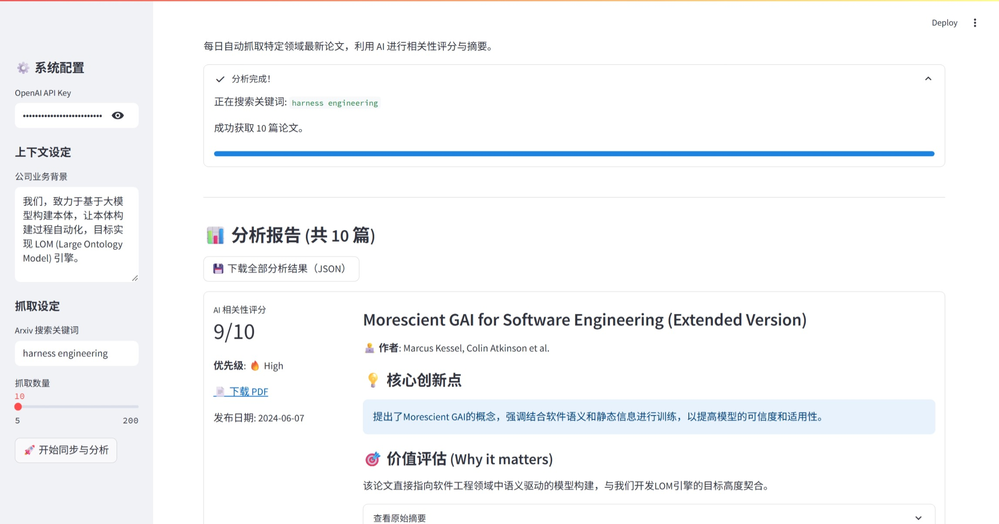

# 📡 Arxiv Insight Sentinel

> Arxiv 每天新增几百篇论文，你真正需要读的可能只有 3 篇。
>
> 告诉它你在关注什么，它每天自动帮你筛出来、打分、总结核心贡献——你只需要决定读哪篇。

  

---

## 它解决什么问题

做 AI 研究或工程的人都有这个困境：

- Arxiv 每天 cs.AI + cs.CV + cs.LG 三个方向加起来新增 **200-400 篇**论文
- 你真正需要的可能只有 **3-5 篇**
- 但你不知道哪 3 篇，所以你要么全扫一遍标题（30分钟），要么干脆不看（错过重要进展）

这个工具做的事：**把你的研究背景和关注方向告诉它，它替你扫完所有论文，按相关性打分排序，每篇给一句话核心贡献总结，你只看 Top 10 就够了。**

---

## 它输出什么

运行一次后，你会得到一份按优先级排好序的报告，每篇论文包含：

```
[9.2/10] ██████████
Retrieval-Augmented Generation with Graph-Structured Memory

核心贡献：提出将知识图谱作为 RAG 的记忆层，
解决传统向量检索在多跳推理场景下的准确率下降问题，
在 HotpotQA 上比 baseline 提升 11.3%。

与你的相关性：直接命中你关注的 GraphRAG 方向，
方法可直接迁移到你的知识库问答场景。

作者：XXX et al. | 2024-01 | [PDF链接]
```

高分的在前，一眼看出今天有没有值得精读的。



---

## 快速开始

**环境：Python 3.8+，一个 OpenAI 兼容的 API Key**

```bash
git clone https://github.com/liftkkkk/Arxiv-Insight-Sentinel
cd Arxiv-Insight-Sentinel
pip install -r requirements.txt
streamlit run app.py
```

浏览器自动打开界面，三步配置即可使用：

**第一步：填入 API Key**（支持 OpenAI、SiliconFlow、DeepSeek 等任意兼容接口）

**第二步：描述你的研究背景**，例如：
```
我在做 RAG 系统优化，关注知识图谱增强检索、长文档问答、
多跳推理，以及 LLM 推理效率提升。
```

**第三步：设置搜索关键词**，例如：
```
cat:cs.AI AND (RAG OR "knowledge graph" OR "long context")
```

点击「开始分析」，等几分钟，报告生成。

---

## 关键词写法参考

Arxiv 支持标准的布尔搜索语法：

| 想看的方向 | 关键词示例 |
|-----------|-----------|
| 大模型推理 | `cat:cs.AI AND (reasoning OR "chain of thought")` |
| 多模态 | `cat:cs.CV AND (multimodal OR VLM OR "vision language")` |
| RAG / 知识增强 | `cat:cs.AI AND (RAG OR "retrieval augmented")` |
| Agent | `cat:cs.AI AND (agent OR "tool use" OR "function calling")` |
| 模型压缩 | `cat:cs.LG AND (quantization OR pruning OR distillation)` |

多个方向用逗号分隔，程序会分别抓取再合并去重。

---

## 核心逻辑

```
每次运行
    ↓
按关键词从 Arxiv API 抓取最新论文（可设置抓取数量）
    ↓
把你的研究背景 + 每篇论文摘要一起发给 LLM
    ↓
LLM 输出：相关性评分(0-10) + 一句话核心贡献 + 与你背景的关联说明
    ↓
按评分排序，生成可视化报告
    ↓
支持导出 PDF，可以保存每日快报
```

评分标准完全由你的背景描述决定——**你描述得越具体，筛选越精准**。

---

## 配置说明

在 `.env` 文件或界面侧边栏设置：

```env
OPENAI_API_KEY=你的key
OPENAI_BASE_URL=https://api.openai.com/v1   # 换成其他兼容接口地址
```

推荐模型：GPT-4o-mini 或 DeepSeek-V3（速度快、成本低，分析质量够用）。分析 50 篇论文大约消耗 0.1-0.3 元。

---

## 项目结构

```
Arxiv-Insight-Sentinel/
├── app.py           # 全部逻辑（单文件，方便二次修改）
└── requirements.txt
```

故意保持单文件设计——如果你想改评分标准、输出格式、添加邮件推送，直接编辑 `app.py` 就行，不需要理解复杂的模块结构。

---

## Roadmap

- [ ] 定时任务支持（每天早上自动运行，发到邮箱/微信）
- [ ] 论文追踪（关注特定作者，有新论文立刻提醒）
- [ ] 支持 RSS 订阅格式导出
- [ ] 与 Zotero / Notion 集成

---

## License

MIT — 随便用，欢迎 PR 和 Issue。

如果这个工具帮你节省了每天刷论文的时间，欢迎给个 ⭐
